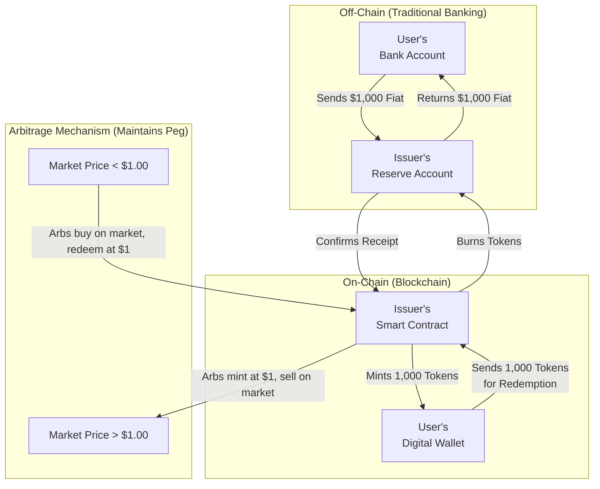
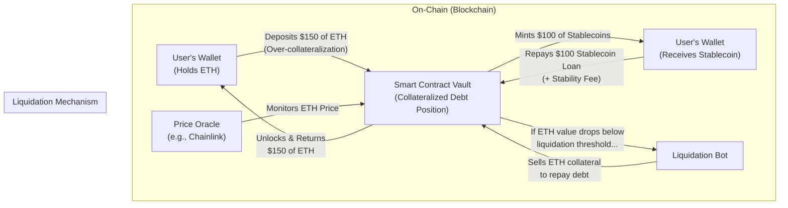

# 2. Types of Stablecoins

Stablecoins can be categorized into four primary types based on their underlying collateral mechanism. Each model presents a unique set of trade-offs between decentralization, stability, and capital efficiency. Understanding these distinctions is critical for assessing the specific risk profile of each stablecoin [\[12\]].

### Fiat-Collateralized Stablecoins

This is the most dominant and widely adopted model, representing over 90% of the total stablecoin market [\[8\]].

*   **Mechanism:** These stablecoins maintain their peg by holding an equivalent amount of fiat currency (or highly liquid cash equivalents like short-term government bonds) in off-chain bank accounts or with regulated custodians [\[2\]], [\[56\]]. For every stablecoin issued, there is a corresponding dollar or other fiat currency unit held in reserve.
*   **Trust Model:** This model is inherently centralized and relies on trust in the issuer to maintain sufficient, verifiable reserves and honor redemptions [\[56\]]. Transparency is paramount, and leading issuers provide regular third-party attestations to verify their reserves [\[21\]].
*   **Key Examples:** Tether (USDT), USD Coin (USDC), and PayPal USD (PYUSD) are the most prominent examples [\[13\]].

### Crypto-Collateralized Stablecoins

This model aims for greater decentralization by using other cryptocurrencies as collateral.

*   **Mechanism:** To mint these stablecoins, users must lock up a greater value of volatile cryptocurrency (like ETH or BTC) than the value of the stablecoins they receive. This practice, known as **over-collateralization**, creates a buffer to absorb price swings in the underlying collateral [\[2\]]. The entire process is managed by on-chain smart contracts.
*   **Trust Model:** Trust is placed in the security and transparency of the smart contract code and the reliability of external price oracles that feed data to the protocol [\[56\]]. Governance is often decentralized, managed by a community of token holders [\[57\]].
*   **Key Examples:** MakerDAO's Dai (DAI) is the most well-known example of a crypto-collateralized stablecoin [\[55\]].

### Commodity-Collateralized Stablecoins

These stablecoins are backed by tangible, real-world assets.

*   **Mechanism:** Their value is pegged to physical commodities, most commonly precious metals like gold [\[4\]]. Each token represents a specific quantity of the underlying physical asset, which is held and audited by a centralized custodian.
*   **Trust Model:** Similar to fiat-backed coins, this model requires trust in a centralized custodian to securely store and manage the physical reserves [\[56\]].
*   **Key Examples:** Pax Gold (PAXG) and Tether Gold (XAUt) are leading examples, offering digital exposure to physical gold [\[4\]].

### Algorithmic Stablecoins

This is the most experimental and historically riskiest category.

*   **Mechanism:** Algorithmic stablecoins are not backed by any direct collateral. Instead, they use complex algorithms and smart contracts to dynamically manage the token's supply in response to market demand, aiming to maintain the price peg [\[16\]]. They often use a dual-token system where a second, volatile token absorbs price fluctuations.
*   **Trust Model:** This model is fully decentralized and relies purely on the integrity of its economic and mathematical models.
*   **Key Examples:** The most famous example is the now-defunct TerraUSD (UST), whose collapse in 2022 highlighted the inherent fragility of this model [\[12\]]. Ampleforth (AMPL) is another example [\[13\]].

### Comparison Table

| Type                        | Collateral Mechanism                       | Trust Model                                    | Key Examples             | Primary Advantage        | Primary Disadvantage      |
| --------------------------- | ------------------------------------------ | ---------------------------------------------- | ------------------------ | ------------------------ | ------------------------- |
| **Fiat-Collateralized**     | 1:1 Fiat Currency / Cash Equivalents       | Centralized trust in issuer & custodian [\[56\]] | USDT, USDC, PYUSD [\[13\]] | High stability, simplicity | Centralization, censorship risk |
| **Crypto-Collateralized**   | Over-collateralized with cryptocurrencies  | Decentralized trust in smart contracts [\[56\]]  | DAI [\[55\]]               | Decentralization, transparency | Capital inefficiency, volatility risk |
| **Commodity-Collateralized**| Physical commodities (e.g., gold)        | Centralized trust in custodian [\[56\]]          | PAXG, XAUt [\[4\]]         | Tangible asset backing   | Custody complexity, market risk |
| **Algorithmic**             | None (algorithmic supply adjustment)     | Trust in economic/mathematical models          | UST (defunct), AMPL [\[13\]] | High decentralization    | Systemic fragility, high risk |
