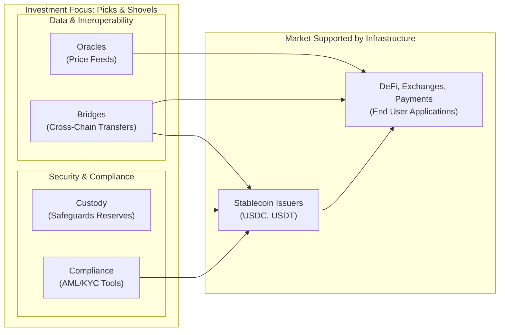

# 4. The "Picks and Shovels" Play: Investing in Ecosystem Infrastructure

While direct investment in stablecoin issuers is a viable strategy, a potentially more attractive, risk-adjusted approach for private equity is to invest in the "picks and shovels" of the stablecoin ecosystem. This strategy focuses on the essential infrastructure, tools, and services that enable the entire market to function and grow, regardless of which specific stablecoin becomes dominant.

> [!TIP]
> **Investment Thesis: The Enabling Layer**
> The "picks and shovels" thesis is a core strategic approach for Marchese PE. It allows us to gain exposure to the high-growth digital asset economy while mitigating the risks associated with investing in a single currency or platform. By focusing on essential, non-speculative infrastructure like custody, compliance, and interoperability, we are investing in the foundational pillars that are necessary for the entire ecosystem to function and scale.

This "enabling layer" represents a set of critical, non-speculative businesses that provide foundational support for the broader digital asset economy.

Key categories within this investment thesis include:

### Custody Solutions

As the stablecoin market grows, so does the need for secure, regulated, and institutional-grade custody solutions. These firms are responsible for safeguarding the massive off-chain reserves that back fiat-collateralized stablecoins and for securing the digital assets of large institutional holders. This is a mission-critical function where trust, security, and regulatory compliance are paramount. As more traditional financial institutions enter the space, the demand for qualified custodians who can navigate both traditional finance regulations and the technical complexities of digital assets will surge [\[25\]](../Resources/10_Central_Bibliography.md#25), [\[69\]](../Resources/10_Central_Bibliography.md#69).

### Compliance and Blockchain Analytics

With the implementation of regulatory frameworks like the GENIUS Act in the U.S. and MiCA in the EU, compliance has become a non-negotiable aspect of the stablecoin market [\[6\]](../Resources/10_Central_Bibliography.md#6), [\[8\]](../Resources/10_Central_Bibliography.md#8). This has created a significant opportunity for companies that provide:

*   **Compliance-as-a-Service:** Tools that help issuers and exchanges meet their Anti-Money Laundering (AML) and Know Your Customer (KYC) obligations.
*   **Blockchain Analytics:** Firms like Chainalysis and Elliptic provide powerful software for tracing transactions on the blockchain, identifying illicit activity, and assessing risk. These tools are indispensable for law enforcement, regulators, and financial institutions [\[38\]](../Resources/10_Central_Bibliography.md#38).

### Oracle Networks

Decentralized stablecoins and a vast array of DeFi applications are fundamentally dependent on **oracle networks** to function. These networks provide a secure and reliable bridge between on-chain smart contracts and off-chain, real-world data, such as asset prices [\[2\]](../Resources/10_Central_Bibliography.md#2).

*   **Chainlink** is the dominant market leader, providing the critical price feeds that secure tens of billions of dollars across DeFi. Oracles are essential for the operation of crypto-collateralized stablecoins, which need real-time price data to manage liquidations and maintain their peg [\[51\]](../Resources/10_Central_Bibliography.md#51).

As the DeFi ecosystem grows, the need for secure and reliable oracle services will become even more critical, making them a foundational element of the "picks and shovels" play.

### Interoperability and Cross-Chain Bridges

The future of blockchain is widely believed to be multi-chain, with different networks optimized for different purposes. This creates a massive need for **interoperability solutions** that allow stablecoins and other digital assets to move seamlessly and securely between different blockchains.

*   **Cross-chain bridges** are protocols that "wrap" an asset on one chain and mint an equivalent version on another, enabling liquidity to flow freely across the entire ecosystem [\[50\]](../Resources/10_Central_Bibliography.md#50), [\[52\]](../Resources/10_Central_Bibliography.md#52). Companies building secure and efficient bridging technology are solving a critical infrastructure problem and are poised for significant growth as the multi-chain world expands.

## 4.1 Custodial Services

As the bridge between on-chain tokens and off-chain reserves, regulated and secure custody is non-negotiable for institutional-grade stablecoins.

*   **Business Model:** Custodians charge fees for safeguarding the fiat and digital assets that back stablecoins. Revenue is typically generated through a combination of asset-based fees (a percentage of assets under custody), transaction fees, and fees for value-added services like reporting and compliance integration.
*   **Key Services:**
    *   **Secure Asset Storage:** Employing advanced security measures like cold storage (offline wallets) and multi-signature (multisig) technology to protect reserves from theft.
    *   **Regulatory Compliance:** Integrating robust KYC/AML (Know Your Customer/Anti-Money Laundering) and sanctions screening processes.
    *   **Insurance:** Providing insurance coverage for custodied assets to mitigate risk of loss.
*   **Investment Thesis:** As the stablecoin market grows and becomes more regulated, the demand for trusted, insured, and institutional-grade custodians will increase significantly. These entities are mission-critical for the functioning of the entire regulated ecosystem.

## 4.2 Auditing and Attestation Services

Trust in the stablecoin market is built on verification. Auditing and attestation firms provide the independent validation required by both regulators and institutional users.

*   **Business Model:** These firms, typically established accounting or specialized security companies, charge fees for their verification services.
*   **Key Services:**
    *   **Reserve Attestations:** Independent CPA firms conduct regular attestations to verify that a stablecoin issuer's off-chain reserves match the value of the tokens in circulation. This is a recurring, high-demand service mandated by new regulations.
    *   **Smart Contract Audits:** Specialized security firms audit the underlying smart contract code of stablecoins and related DeFi protocols to identify vulnerabilities, bugs, and potential exploits. This is a critical security step for any on-chain product.
*   **Investment Thesis:** Regulation (like the GENIUS Act) explicitly mandates monthly disclosures and annual independent audits. This creates a recurring, non-discretionary revenue stream for a select group of trusted auditing firms, making them a direct and stable beneficiary of market growth.

## 4.3 Oracle Networks

Decentralized stablecoins and DeFi protocols cannot function without access to real-world data. Oracle networks provide this essential link.

*   **Business Model:** Oracles operate as decentralized networks that securely and reliably feed external data (like asset prices) to on-chain smart contracts. They generate revenue by charging fees (often in their native token) to the protocols that consume their data feeds.
*   **Key Services:**
    *   **Price Feeds:** Providing accurate, real-time, and tamper-proof price data is the primary use case. This is essential for the liquidation mechanisms in crypto-backed stablecoins and for pricing assets in DeFi lending and trading protocols.
    *   **Proof of Reserve:** Oracles can also be used to provide on-chain, verifiable proof of an issuer's off-chain reserves, enhancing transparency.
*   **Key Players:** Chainlink is the dominant market leader in this category.
*   **Investment Thesis:** Oracles are a foundational, non-negotiable piece of infrastructure for the entire DeFi ecosystem. As the value secured by DeFi protocols grows, the demand for highly secure and reliable oracle services will grow in tandem.

## 4.4 Blockchain Analytics & Compliance Tools

As regulators focus on preventing illicit activity, the tools for on-chain monitoring and compliance have become indispensable for any entity operating in the space.

*   **Business Model:** These firms operate on a B2B SaaS (Software-as-a-Service) model, selling subscriptions to their analytics and compliance platforms to financial institutions, crypto businesses, and government agencies.
*   **Key Services:**
    *   **Transaction Monitoring (KYT):** Real-time tracking and analysis of stablecoin transactions to detect suspicious patterns, money laundering, and sanctions evasion.
    *   **Wallet and Exchange Risk Scoring:** Providing risk profiles for specific crypto addresses and exchanges to help institutions manage counterparty risk.
    *   **Forensic Investigations:** Offering advanced tools to trace the flow of illicit funds on the blockchain.
*   **Key Players:** Chainalysis and Elliptic are market leaders in this space.
*   **Investment Thesis:** With AML/BSA compliance now a strict requirement for all regulated stablecoin issuers, the services provided by these analytics firms have shifted from a "nice-to-have" to a "must-have." They are critical vendors for the entire regulated digital asset industry, with a strong, recurring revenue model tied directly to regulatory mandates.
