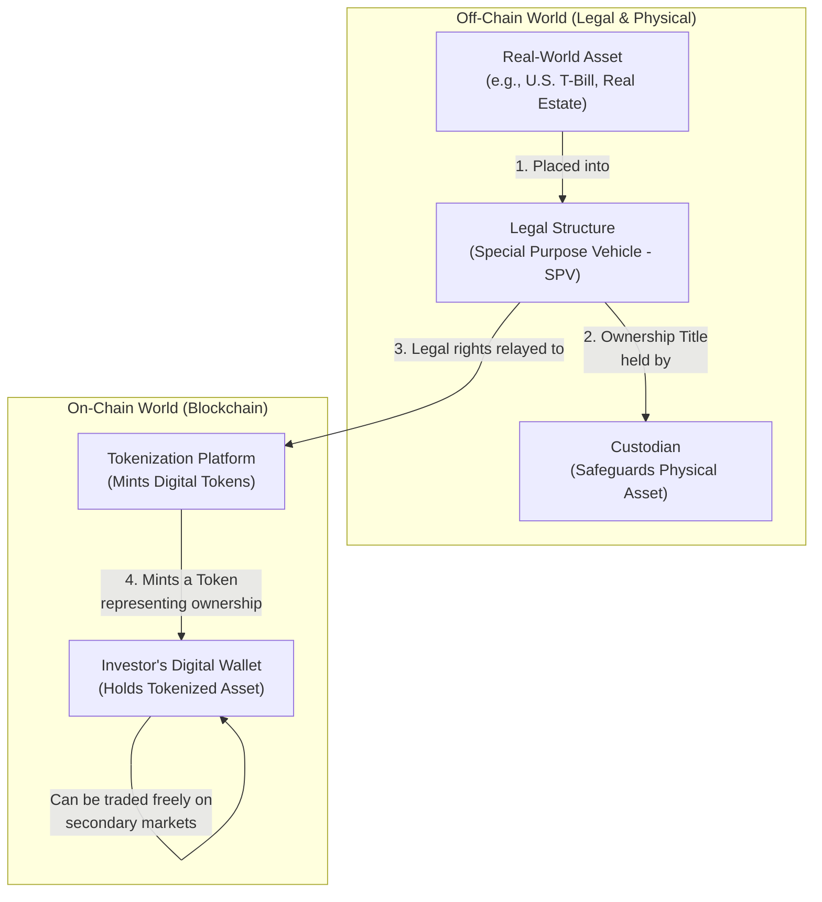

# 5: The Next Frontier: Yield-Bearing Assets and RWA Tokenization

The initial innovation of stablecoins was solving for stability. The next, and arguably more transformative, innovation is the creation of native, on-chain yield. This is being driven by two interconnected trends: the rise of **yield-bearing stablecoins** and the **tokenization of Real-World Assets (RWAs)**. This fusion represents the deepest integration yet between the traditional financial system and the digital asset ecosystem.

## 5.1 The Concept of On-Chain Yield

Traditional stablecoins like USDC and USDT do not typically pass the yield they generate from their underlying reserves (e.g., interest from U.S. T-bills) on to the token holder. The issuer captures this yield as its primary revenue stream.

Yield-bearing stablecoins and tokenized RWAs disrupt this model. They are designed to programmatically and transparently pass the yield generated by the underlying off-chain assets directly to the on-chain token holder. This allows investors to access real-world yields with the speed, efficiency, and transparency of blockchain technology.

## 5.2 Real-World Asset (RWA) Tokenization

RWA tokenization is the process of creating a digital representation (a token) of a real-world asset on a blockchain. This is the core engine that brings off-chain value and yield into the on-chain world.

*   **The Process:** A fund manager or issuer acquires a real-world asset (e.g., U.S. Treasury bills, private credit loans, real estate). They then create a token on a blockchain that represents a legal claim on that underlying asset and any income it generates.
*   **Key Asset Classes:** While a wide range of assets can be tokenized, the most significant early traction has been in:
    *   **U.S. Treasury Bills:** This is the foundational RWA. The low-risk, stable yield of T-bills makes them an ideal "base layer" for on-chain finance.
    *   **Private Credit:** Tokenizing private credit loans offers the potential to bring liquidity to a traditionally illiquid asset class, allowing for fractional ownership and faster settlement.
    *   **Real Estate:** While more complex, tokenization can enable fractional ownership of income-producing real estate assets.

## 5.3 The Competitive Landscape: TradFi Giants Enter the Arena

The RWA tokenization space is not being led by crypto startups; it is being dominated by some of the largest asset managers in the world. This "institutionalization" is a powerful validation of the technology and a key indicator of future growth.

### BlackRock (BUIDL)

*   **Product:** BlackRock, the world's largest asset manager, launched the BlackRock USD Institutional Digital Liquidity Fund (BUIDL) on the Ethereum network. BUIDL is a tokenized money market fund that invests in U.S. Treasury bills and repo agreements.
*   **Mechanism:** Each BUIDL token is pegged to $1 and pays out its daily accrued yield directly to the token holder's wallet in the form of new tokens.
*   **Strategic Significance:** BlackRock's entry is a watershed moment. It signals to the entire financial industry that tokenization is a core part of the future of asset management. Their participation brings unparalleled legitimacy, distribution, and expertise to the space. BUIDL quickly amassed nearly **$300 million** in assets, demonstrating the immense institutional demand.

### Franklin Templeton (FOBXX)

*   **Product:** Franklin Templeton, another major asset manager, was an early pioneer with its OnChain U.S. Government Money Fund (FOBXX), which is also represented by the BENJI token.
*   **Mechanism:** Similar to BUIDL, FOBXX tokenizes shares of a money market fund that invests in government securities, with yield accruing to token holders.
*   **Strategic Significance:** Franklin Templeton's early and persistent efforts in this space have helped pave the way for other institutions. Their success demonstrated the viability of the model and helped work through many of the early operational and regulatory hurdles.

## 5.4 Investment Implications

The rise of tokenized RWAs and yield-bearing assets creates several compelling investment theses:

1.  **The New Financial Plumbing:** The platforms and protocols that facilitate the secure tokenization, custody, and transfer of RWAs are becoming essential new financial infrastructure. Investing in these platforms is a bet on the underlying rails of the future of asset management.
2.  **Specialized Tokenization Platforms:** While giants like BlackRock may dominate public market assets like T-bills, significant opportunities exist for specialized platforms focused on tokenizing more illiquid or complex assets, such as private credit, trade finance, or carbon credits. These niches may offer higher margins and less competition.
3.  **Enhanced Liquidity and Efficiency:** Tokenization has the potential to bring unprecedented liquidity to traditionally illiquid asset classes. This can unlock significant value and create new secondary markets for assets that are currently difficult to trade, presenting opportunities for market-making and arbitrage.

# 5. Yield-Bearing Assets & Real-World Asset (RWA) Tokenization

Perhaps the most significant evolution in the stablecoin space is the emergence of **yield-bearing stablecoins (YBSs)** and the broader trend of **Real-World Asset (RWA) tokenization**. This represents a powerful convergence of traditional finance (TradFi) and decentralized finance (DeFi), creating entirely new, highly efficient financial products.

> [!WARNING]
> **A Disruptive Force in Asset Management**
> The rise of tokenized RWA and on-chain yield represents a fundamental challenge to the traditional asset management model. By creating more efficient, transparent, and accessible financial products, this trend could disintermediate traditional players and compress fees across the industry. For Marchese PE, this is both a threat to legacy investments and a significant opportunity to invest in the disruptive innovators.

### The Rise of On-Chain Yield

Historically, stablecoins were non-interest-bearing digital cash equivalents. The opportunity cost of holding them was the yield that could be earned elsewhere. YBSs directly solve this problem by offering native, on-chain yield, effectively creating a tokenized version of a high-yield savings account or money market fund [\[53\]](../Resources/10_Central_Bibliography.md#53), [\[54\]](../Resources/10_Central_Bibliography.md#54).

*   **Mechanism:** Yield is typically generated by investing the underlying stablecoin reserves in safe, interest-bearing assets, most commonly short-term U.S. Treasury bills [\[23\]](../Resources/10_Central_Bibliography.md#23). The yield from these T-bills is then passed through to the token holder.
*   **Market Growth:** This market segment has experienced explosive growth, surging from $660 million in August 2023 to nearly $10 billion by May 2025 [\[23\]](../Resources/10_Central_Bibliography.md#23).

### RWA Tokenization: The Broader Trend

YBSs are part of a larger movement to tokenize real-world assets. RWA tokenization is the process of creating a digital, blockchain-based token that represents ownership of a real-world asset. This can include public securities (like T-bills), private credit, real estate, art, and more [\[61\]](../Resources/10_Central_Bibliography.md#61), [\[62\]](../Resources/10_Central_Bibliography.md#62).

The tokenization of U.S. Treasuries has been the leading use case, with the market for tokenized T-bills reaching over $4 billion [\[27\]](../Resources/10_Central_Bibliography.md#27). This is because they offer a stable, low-risk, and government-backed source of yield that is highly attractive to both crypto-native and traditional investors.

### Key Players and Competitive Dynamics

This high-growth area is attracting both financial giants and crypto innovators:

*   **BlackRock (BUIDL):** The world's largest asset manager launched its BlackRock USD Institutional Digital Liquidity Fund (BUIDL), a tokenized money market fund that invests in cash, U.S. Treasuries, and repurchase agreements. BUIDL has seen massive institutional adoption, quickly growing to over $2.8 billion in assets under management. It pays a daily yield to investors in the form of new tokens [\[63\]](../Resources/10_Central_Bibliography.md#63), [\[70\]](../Resources/10_Central_Bibliography.md#70).
*   **Franklin Templeton (FOBXX):** Another major asset manager, Franklin Templeton, was the first to launch a tokenized money market fund in the U.S. Its OnChain U.S. Government Money Fund (FOBXX) is available on multiple blockchains and represents a significant move by a TradFi giant to embrace tokenization [\[63\]](../Resources/10_Central_Bibliography.md#63).
*   **Ondo Finance (OUSG/USDY):** A leading crypto-native player, Ondo offers tokenized notes (USDY) and funds (OUSG) backed by short-term U.S. Treasuries and bank deposits. Ondo has built a strong brand around its regulatory-first design and institutional-grade products [\[64\]](../Resources/10_Central_Bibliography.md#64).
*   **Circle (USYC):** Through its acquisition of Hashnote, Circle now offers the USYC, a yield-bearing token backed by short-term U.S. T-bills. It is currently available only to non-U.S. institutional clients [\[68\]](../Resources/10_Central_Bibliography.md#68).

The entry of major asset managers like BlackRock and Franklin Templeton is a powerful validation of the RWA tokenization thesis. They bring immense credibility, distribution networks, and regulatory expertise, which is likely to accelerate institutional adoption. However, crypto-native firms like Ondo are competing effectively by being more agile, building on public blockchains, and creating innovative, crypto-native features.

This convergence is creating a new competitive landscape where the lines between asset management, banking, and crypto are blurring. The ability to offer compliant, transparent, and efficient on-chain yield is becoming a key battleground for the future of finance.
