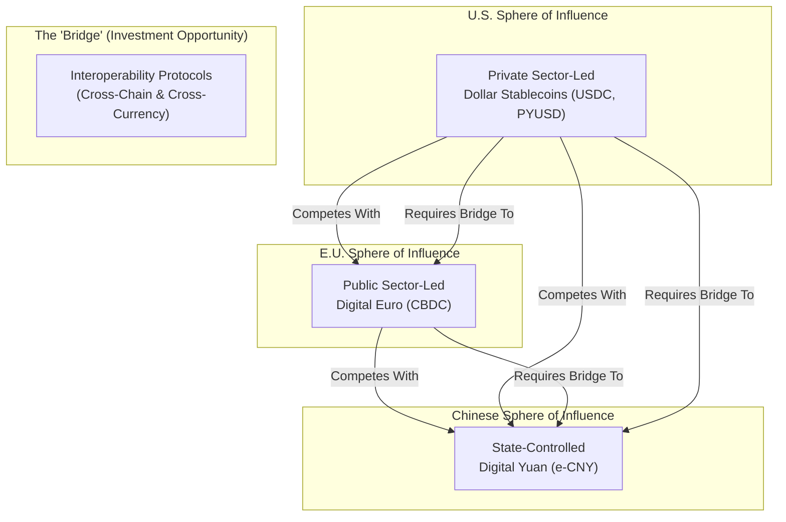

# Chapter 7: The Geopolitics of Digital Money

The rise of digital currencies is not merely a financial or technological story; it is a central issue in modern geopolitics. The development and regulation of stablecoins and Central Bank Digital Currencies (CBDCs) have become key instruments through which nations are asserting economic influence, projecting power, and competing to shape the future of the global financial system.

## 7.1 The U.S. Strategy: Reinforcing Dollar Dominance Through Private Sector Innovation

The United States' pro-stablecoin, anti-retail CBDC stance is a clear and deliberate geopolitical strategy. By fostering a regulated, private-sector-led market for dollar-pegged stablecoins, the U.S. aims to **extend and reinforce the hegemony of the U.S. dollar** in the digital age `[26]`.

The core logic is that as global commerce and finance become increasingly digital, the currency that dominates digital transactions will have a significant advantage. Stablecoins, overwhelmingly pegged to the USD, provide a ready-made vehicle for the dollar to become the de facto currency of the internet and the DeFi ecosystem. This strategy has several key benefits for the U.S.:

*   **Countering De-Dollarization:** It provides a powerful counter-narrative to "de-dollarization" efforts by other nations. By making a digital dollar accessible to anyone with an internet connection, it expands the dollar's reach far beyond the traditional banking system, particularly in emerging markets `[46]`.
*   **Driving Demand for U.S. Debt:** As the stablecoin market grows, so does the demand from issuers for safe, liquid assets for their reserves. This has turned stablecoin issuers into a major new source of demand for U.S. Treasury securities, helping to finance U.S. government debt at a time when traditional foreign demand is waning `[46, 47]`.
*   **Leveraging Private Sector Strengths:** The U.S. is betting on the innovative capacity and global reach of its private sector (e.g., Circle, PayPal) to out-compete state-led CBDC projects, which may be slower to develop and deploy.

## 7.2 The Counter-Strategy: CBDCs and Monetary Sovereignty

Many other nations and blocs, particularly the European Union and China, have viewed the rise of private, dollar-denominated stablecoins as a potential threat to their own monetary sovereignty. Their primary response has been the aggressive development of state-controlled CBDCs.

*   **The European Union:** The EU's push for a "digital euro" and its simultaneous capping of non-euro stablecoin usage under MiCA are explicit geopolitical moves. The goal is to ensure that the euro, not the dollar, is the dominant digital currency for commerce and savings within the Eurozone. The EU is betting that a state-backed CBDC will offer a level of safety and integration with public services that private stablecoins cannot match, thereby carving out a protected digital currency bloc.
*   **China:** China's Digital Yuan (e-CNY) is the most advanced major CBDC project in the world. Its development is driven by a desire for greater domestic control over payments and a long-term strategy to internationalize the yuan. China is actively promoting the e-CNY for cross-border trade with its Belt and Road Initiative partners, attempting to create a parallel financial system that is less reliant on the dollar and the SWIFT messaging network.

## 7.3 The New Battleground: Competing Financial Stacks

The world is witnessing the emergence of three competing models for the future of money, each with a distinct geopolitical alignment:

1.  **The U.S. Model (Private/Public):** A regulated ecosystem of privately-issued, dollar-backed stablecoins, built on open, permissionless blockchains. This model prioritizes innovation, global reach, and the extension of existing monetary influence.
2.  **The EU Model (Public/Regulated):** A state-issued CBDC (the digital euro) existing alongside a tightly regulated and capped private stablecoin market. This model prioritizes monetary sovereignty, consumer protection, and regional economic integration.
3.  **The Chinese Model (State-Controlled):** A fully state-run, top-down CBDC (the e-CNY) designed for maximum domestic control and targeted international expansion. This model prioritizes state surveillance and control over the financial system.

## 7.4 Strategic Implications for Investment

This geopolitical competition is a critical macro factor for any investment in the digital asset space.

*   **Currency Blocs are Forming:** The future of digital finance is unlikely to be a single, globalized system. Instead, it is fracturing into distinct currency and technology blocs, primarily centered around the USD, EUR, and CNY.
*   **Regulation as a Geopolitical Tool:** Regulatory decisions, such as MiCA's caps on non-euro stablecoins, will be used as explicit tools of industrial and geopolitical policy. Investors must anticipate these moves.
*   **The "Neutral" Ground:** The competition between these blocs creates opportunities for neutral infrastructure providers, such as cross-chain interoperability protocols or blockchain analytics firms, that can service all sides of the emerging digital currency world.

### A New Digital Economic Map

This strategic divergence is creating a new, fragmented global financial map with three emerging spheres of influence:

1.  **The U.S. Dollar Stablecoin Zone:** A largely private-sector-driven ecosystem centered around USD-pegged stablecoins, deeply integrated with global crypto markets.
2.  **The Euro CBDC Zone:** A more state-controlled ecosystem designed to protect the Euro and foster a domestic digital payments market.
3.  **The Chinese CBDC Zone:** A highly centralized, state-run system (e-CNY) focused on domestic control and international trade settlement with strategic partners.

Navigating this fragmented landscape will be a primary challenge for multinational corporations and investors. The need for **interoperability solutions**, such as cross-chain bridges and universal messaging standards, will become even more critical to connect these distinct economic blocs `[51]`. For Marchese PE, this geopolitical lens is essential for understanding country-specific risks and identifying opportunities in the "bridging" technologies that will be required to facilitate commerce across this new digital divide.
