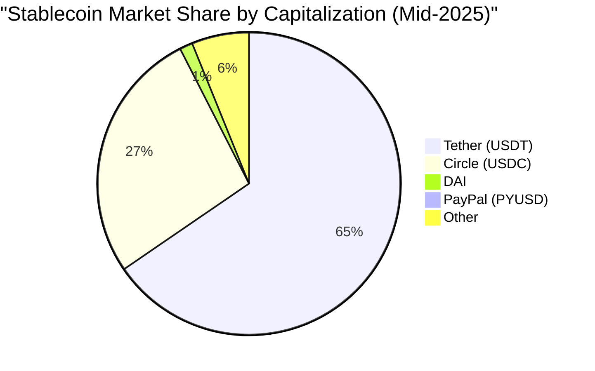

# 3. Market Landscape and Key Players

The stablecoin market has demonstrated robust growth and is dominated by a few key players, though emerging competitors are beginning to gain traction.

### Market Size and Growth

The stablecoin market has expanded significantly, with its total market capitalization surging from $138 billion in February 2024 to over $230 billion by May 2025 [\[23\]]. Projections suggest this market could continue its exponential growth, potentially reaching $2 trillion by 2028 [\[7\]].

This growth is not just in value but also in utility. In 2024, stablecoin networks processed an astounding $27.6 trillion in transactions, a volume that surpassed the combined total of payment giants Visa and Mastercard [\[8\]]. This highlights a fundamental shift of stablecoins from being niche crypto trading instruments to core components of global payment infrastructure [\[55\]].

### Key Players and Market Share

The market is highly concentrated, with two primary issuers accounting for the vast majority of the market share.

*   **Tether (USDT):** As the largest and oldest major stablecoin, USDT maintains a dominant market capitalization, fluctuating between $141 billion and $158 billion as of mid-2025 [\[12\]], [\[14\]]. Its primary competitive advantage lies in its deep liquidity and widespread integration across nearly every cryptocurrency exchange, making it the most used stablecoin for trading and cross-border payments [\[21\]]. However, it has historically faced scrutiny regarding the transparency and composition of its reserves [\[12\]].
*   **Circle (USDC):** The second-largest stablecoin, USDC, has a market capitalization of approximately $62 billion [\[8\]]. Circle has built its brand on a foundation of **regulatory compliance and transparency**, providing regular, third-party audited attestations of its reserves since 2018 [\[21\]]. This focus has made it the preferred stablecoin for many institutional users and has facilitated key integrations with traditional financial players like Visa and Mastercard. Circle's public listing in May 2025 further solidified its position as a leading regulated player [\[68\]].
*   **PayPal USD (PYUSD):** A significant new entrant, PYUSD is issued by Paxos Trust Company and integrated directly into PayPal's massive global network. This has allowed for rapid adoption, with its market cap surging from $399 million to $775 million in just three months in early 2025 [\[22\]]. PYUSD's primary use case is for seamless merchant payments within the PayPal ecosystem.
*   **DAI:** As the leading decentralized stablecoin, Dai is issued by the MakerDAO protocol and backed by a diversified basket of on-chain crypto assets [\[55\]]. It maintains a smaller market capitalization (around $3.18 billion as of April 2025) and is primarily used within the DeFi ecosystem for lending, borrowing, and trading [\[21\]].

> **The Core Market Tension**
> The competitive dynamic between the established players highlights a key market tension: **Tether's deep liquidity and network effects** versus **Circle's strategy of regulatory compliance and transparency**. While institutional adoption trends favor regulated options like USDC, the multi-chain liquidity of USDT ensures its continued dominance, particularly in global trading and less-regulated jurisdictions [\[21\]]. The rapid rise of PYUSD underscores the power of leveraging existing, large-scale distribution networks to drive adoption.

## 3.2 The Duopoly: Tether (USDT) vs. Circle (USDC)

The stablecoin issuance market is highly concentrated, with two dominant players, Tether and Circle, commanding over 90% of the total market share.

### Tether (USDT)

*   **Market Position:** Tether is the largest stablecoin by market capitalization, with over **$150 billion** in circulation. Its dominance is rooted in its first-mover advantage, deep liquidity, and widespread integration across nearly every cryptocurrency exchange globally.
*   **Competitive Strengths:** USDT's primary advantage is its unparalleled network effect. It is the most widely accepted and traded stablecoin, making it the de facto choice for crypto trading and cross-border settlements in many parts of the world.
*   **Risks and Controversies:** Despite its market leadership, Tether has faced persistent scrutiny regarding the transparency and composition of its reserves. Unlike its main competitor, it has not consistently provided full, independent audits, leading to lingering concerns for some institutional participants.

### Circle (USDC)

*   **Market Position:** Circle's USDC is the second-largest stablecoin, with a market capitalization of over **$60 billion**. It has positioned itself as the regulated, compliant alternative to Tether.
*   **Competitive Strengths:** Circle's core differentiator is its commitment to transparency and regulatory compliance. It provides monthly reserve attestations from third-party accounting firms and has established strong relationships with traditional banking partners and regulators. This focus has made USDC the preferred stablecoin for many institutional users and DeFi protocols operating in jurisdictions with stricter compliance requirements. Circle's public listing on the NYSE in 2025 further solidified its position as a legitimate, mainstream financial entity.
*   **Strategic Focus:** Circle is actively building an ecosystem around USDC, including payment networks and cross-chain transfer protocols, aiming to be a core infrastructure provider for the future of internet finance.

The competitive dynamic between USDT and USDC highlights a key tension in the market: the trade-off between USDT's deep, unrivaled liquidity and network effects versus USDC's regulatory transparency and institutional trust.

## 3.3 Emerging Challengers

While the market is dominated by a duopoly, several emerging players are carving out significant niches.

### PayPal (PYUSD)

*   **Strategy:** PayPal's entry into the market with its PYUSD stablecoin represents a pivotal moment for mainstream adoption. By leveraging its vast global network of millions of consumers and merchants, PayPal is integrating stablecoin payments directly into its existing platform.
*   **Impact:** PYUSD has seen explosive growth, quickly reaching a market cap of over **$775 million**. This demonstrates the immense power of leveraging existing distribution channels. PayPal's move is a significant validation of stablecoins for everyday e-commerce and peer-to-peer payments, potentially introducing a massive new user base to the technology.

### MakerDAO (DAI)

*   **Strategy:** As the leading decentralized stablecoin, DAI offers a fundamentally different value proposition. It is not backed by fiat reserves but by a diversified, over-collateralized basket of on-chain crypto assets. Its stability and operations are managed by a decentralized community through the Maker Protocol.
*   **Market Position:** DAI holds a market capitalization of over **$3 billion**. Its primary use case is within the DeFi ecosystem, where its censorship resistance and on-chain transparency are highly valued. However, its reliance on volatile crypto collateral and its more complex mechanism present different risk factors compared to fiat-backed models.
