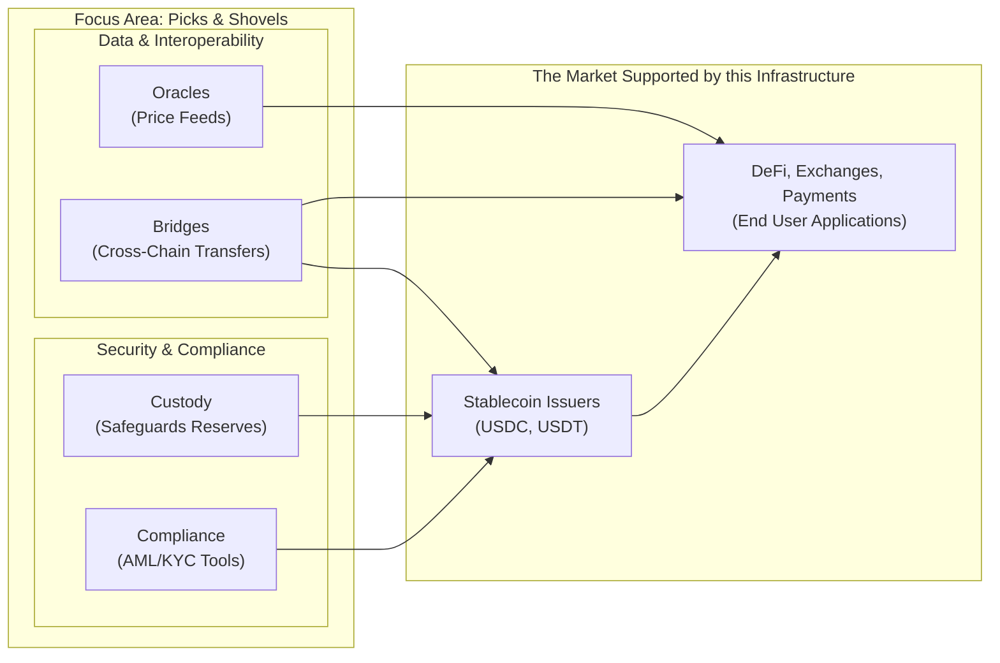

# 4. The "Picks and Shovels" Story: Understanding the Ecosystem's Infrastructure

Instead of focusing on specific stablecoins, it's often more interesting to look at the "picks and shovels" of the ecosystem. This approach means focusing on the essential infrastructure, tools, and services that allow the entire market to work, regardless of which particular stablecoin comes out on top.

> **A Helpful Analogy: The Enabling Layer**
> The "picks and shovels" idea is a useful way to think about the digital asset economy. It shifts the focus to the non-speculative, foundational pillars that are necessary for the whole ecosystem to function and grow, like custody, compliance, and tools that let different systems talk to each other.

This "enabling layer" is made up of a few critical business types that support the broader digital asset economy.

Here are the key parts of this infrastructure:

### Custody Solutions

As the stablecoin market gets bigger, the need for secure, regulated, and professional-grade custody solutions grows with it. These companies are in charge of protecting the massive off-chain reserves that back fiat-collateralized stablecoins and securing the digital assets of large institutions. This is a critical role where trust and security are everything. As more traditional financial players get involved, the demand for qualified custodians who understand both traditional finance rules and the tech behind digital assets is set to increase dramatically [\[25\]], [\[69\]].

### Compliance and Blockchain Analytics

With new regulatory frameworks like the GENIUS Act in the U.S. and MiCA in the EU, compliance is no longer optional [\[6\]], [\[8\]]. This has created a big opportunity for companies that provide:

*   **Compliance-as-a-Service:** Tools that help stablecoin issuers and exchanges meet their Anti-Money Laundering (AML) and Know Your Customer (KYC) requirements.
*   **Blockchain Analytics:** Firms like Chainalysis and Elliptic have powerful software for following transactions on the blockchain, spotting illicit activity, and evaluating risk. These tools are becoming essential for law enforcement, regulators, and financial institutions [\[38\]].

### Oracle Networks

Decentralized stablecoins and many other DeFi applications simply can't work without **oracle networks**. These networks act as a secure bridge between on-chain smart contracts and off-chain, real-world data, like asset prices [\[2\]].

*   **Chainlink** is the clear market leader here, providing the critical price feeds that secure tens of billions of dollars across the DeFi world. Oracles are vital for crypto-collateralized stablecoins, which need real-time price data to manage their collateral and maintain their peg [\[51\]].

As DeFi grows, the need for reliable oracle services will only become more critical, making them a foundational part of the "picks and shovels" landscape.

### Interoperability and Cross-Chain Bridges

Most people believe the future of blockchain is a "multi-chain" one, with different networks built for different jobs. This is a huge need for **interoperability solutions** that let stablecoins and other digital assets move smoothly and securely from one blockchain to another.

*   **Cross-chain bridges** are protocols that "lock" an asset on one chain and create an equivalent version on another. This lets money and data flow freely across the entire ecosystem [\[50\]], [\[52\]]. Companies that are building secure and efficient bridging technology are solving a major infrastructure problem and are well-positioned to grow as the multi-chain world expands.
