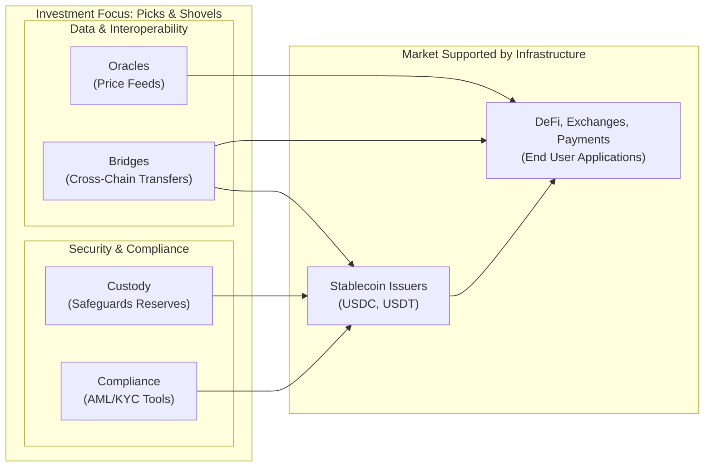

# 4. The "Picks and Shovels" Play: Investing in Ecosystem Infrastructure

While direct investment in stablecoin issuers is a viable strategy, a potentially more attractive, risk-adjusted approach for private equity is to invest in the "picks and shovels" of the stablecoin ecosystem. This strategy focuses on the essential infrastructure, tools, and services that enable the entire market to function and grow, regardless of which specific stablecoin becomes dominant.

> [!TIP]
> **Investment Thesis: The Enabling Layer**
> The "picks and shovels" thesis is a core strategic approach for Marchese PE. It allows us to gain exposure to the high-growth digital asset economy while mitigating the risks associated with investing in a single currency or platform. By focusing on essential, non-speculative infrastructure like custody, compliance, and interoperability, we are investing in the foundational pillars that are necessary for the entire ecosystem to function and scale.

This "enabling layer" represents a set of critical, non-speculative businesses that provide foundational support for the broader digital asset economy.

Key categories within this investment thesis include:

### Custody Solutions

As the stablecoin market grows, so does the need for secure, regulated, and institutional-grade custody solutions. These firms are responsible for safeguarding the massive off-chain reserves that back fiat-collateralized stablecoins and for securing the digital assets of large institutional holders. This is a mission-critical function where trust, security, and regulatory compliance are paramount. As more traditional financial institutions enter the space, the demand for qualified custodians who can navigate both traditional finance regulations and the technical complexities of digital assets will surge [\[25\]](Resources/10_Central_Bibliography.md#25), [\[69\]](Resources/10_Central_Bibliography.md#69).

### Compliance and Blockchain Analytics

With the implementation of regulatory frameworks like the GENIUS Act in the U.S. and MiCA in the EU, compliance has become a non-negotiable aspect of the stablecoin market [\[6\]](Resources/10_Central_Bibliography.md#6), [\[8\]](Resources/10_Central_Bibliography.md#8). This has created a significant opportunity for companies that provide:

*   **Compliance-as-a-Service:** Tools that help issuers and exchanges meet their Anti-Money Laundering (AML) and Know Your Customer (KYC) obligations.
*   **Blockchain Analytics:** Firms like Chainalysis and Elliptic provide powerful software for tracing transactions on the blockchain, identifying illicit activity, and assessing risk. These tools are indispensable for law enforcement, regulators, and financial institutions [\[38\]](Resources/10_Central_Bibliography.md#38).

### Oracle Networks

Decentralized stablecoins and a vast array of DeFi applications are fundamentally dependent on **oracle networks** to function. These networks provide a secure and reliable bridge between on-chain smart contracts and off-chain, real-world data, such as asset prices [\[2\]](Resources/10_Central_Bibliography.md#2).

*   **Chainlink** is the dominant market leader, providing the critical price feeds that secure tens of billions of dollars across DeFi. Oracles are essential for the operation of crypto-collateralized stablecoins, which need real-time price data to manage liquidations and maintain their peg [\[51\]](Resources/10_Central_Bibliography.md#51).

As the DeFi ecosystem grows, the need for secure and reliable oracle services will become even more critical, making them a foundational element of the "picks and shovels" play.

### Interoperability and Cross-Chain Bridges

The future of blockchain is widely believed to be multi-chain, with different networks optimized for different purposes. This creates a massive need for **interoperability solutions** that allow stablecoins and other digital assets to move seamlessly and securely between different blockchains.

*   **Cross-chain bridges** are protocols that "wrap" an asset on one chain and mint an equivalent version on another, enabling liquidity to flow freely across the entire ecosystem [\[50\]](Resources/10_Central_Bibliography.md#50), [\[52\]](Resources/10_Central_Bibliography.md#52). Companies building secure and efficient bridging technology are solving a critical infrastructure problem and are poised for significant growth as the multi-chain world expands.
