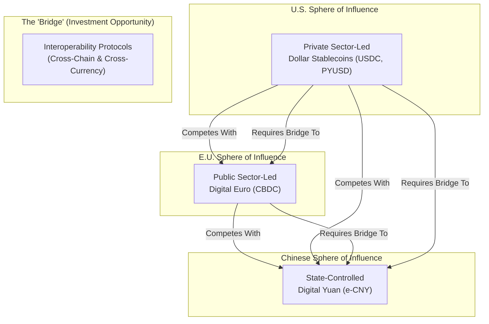

# 7. The Geopolitics of Digital Money

The rise of digital currencies is not merely a technological or financial evolution; it is a new arena for geopolitical competition. The divergent strategies of major global powers, particularly the United States and the European Union, are deeply intertwined with long-term goals of maintaining economic influence, projecting power, and shaping the future architecture of global finance.

### The U.S. Strategy: Reinforcing Dollar Dominance Through Private Sector Innovation

The United States' pro-stablecoin, anti-retail CBDC stance is a clear and deliberate geopolitical strategy. By fostering a regulated, private-sector-led market for dollar-pegged stablecoins, the U.S. aims to **extend and reinforce the hegemony of the U.S. dollar** in the digital age [\[26\]].

The core logic is that as global commerce and finance become increasingly digital, the currency that dominates digital transactions will have a significant advantage. Stablecoins, overwhelmingly pegged to the USD, provide a ready-made vehicle for the dollar to become the de facto currency of the internet and the DeFi ecosystem. This strategy has several key benefits for the U.S.:

*   **Countering De-Dollarization:** It provides a powerful counter-narrative to "de-dollarization" efforts by other nations. By making a digital dollar accessible to anyone with an internet connection, it expands the dollar's reach far beyond the traditional banking system, particularly in emerging markets [\[46\]].
*   **Driving Demand for U.S. Debt:** As the stablecoin market grows, so does the demand from issuers for safe, liquid assets for their reserves. This has turned stablecoin issuers into a major new source of demand for U.S. Treasury securities, helping to finance U.S. government debt at a time when traditional foreign demand is waning [\[46\]], [\[47\]].
*   **Leveraging Private Sector Strengths:** The U.S. is betting on the innovative capacity and global reach of its private sector (e.g., Circle, PayPal) to out-compete state-led CBDC projects, which may be slower to develop and deploy.

### The EU & China Strategy: Asserting Monetary Sovereignty with CBDCs

In contrast, the European Union and China are championing state-controlled Central Bank Digital Currencies. Their motivations are largely defensive and centered on **asserting monetary sovereignty**.

*   **Preventing "Digital Dollarization":** European policymakers are explicitly concerned that without a viable digital euro, the EU's economy could become "digitally dollarized" through the widespread adoption of USD-pegged stablecoins [\[49\]]. This would erode the European Central Bank's (ECB) ability to conduct effective monetary policy and could make the Eurozone economy dependent on U.S. financial infrastructure. The EU's MiCA regulation, with its strict controls on foreign stablecoins, is a direct expression of this defensive posture [\[16\]].
*   **Reducing Reliance on Foreign Networks:** Both the EU and China view CBDCs as a way to reduce their reliance on U.S.-controlled payment networks (like Visa and Mastercard) and financial messaging systems (like SWIFT). A domestic CBDC provides a sovereign payment rail that is insulated from foreign political pressure or sanctions [\[39\]].
*   **Projecting Global Influence:** For China, the e-CNY is also a tool for projecting economic influence and promoting the international use of the yuan, particularly within its Belt and Road Initiative partner countries.

### A New Digital Economic Map

This strategic divergence is creating a new, fragmented global financial map with three emerging spheres of influence:

1.  **The U.S. Dollar Stablecoin Zone:** A largely private-sector-driven ecosystem centered around USD-pegged stablecoins, deeply integrated with global crypto markets.
2.  **The Euro CBDC Zone:** A more state-controlled ecosystem designed to protect the Euro and foster a domestic digital payments market.
3.  **The Chinese CBDC Zone:** A highly centralized, state-run system (e-CNY) focused on domestic control and international trade settlement with strategic partners.

Navigating this fragmented landscape will be a primary challenge for multinational corporations and investors. The need for **interoperability solutions**, such as cross-chain bridges and universal messaging standards, will become even more critical to connect these distinct economic blocs [\[51\]]. For Marchese PE, this geopolitical lens is essential for understanding country-specific risks and identifying opportunities in the "bridging" technologies that will be required to facilitate commerce across this new digital divide.
